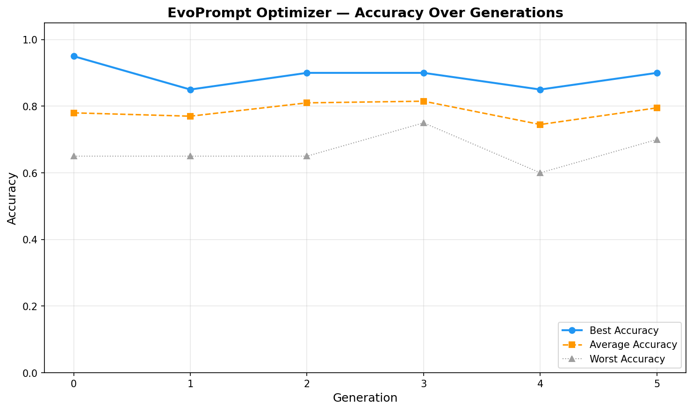

# EvoPrompt Optimizer

> **Proje Kodu: HZ-2026-001** — Hesapsal Zeka Dersi Vize Ödevi  
> **Neuroevolution Tabanlı LLM Prompt Optimizasyonu ile Haber Sınıflandırma**

LLM parametrelerini dondurarak yalnızca prompt'u genetik algoritma ile optimize eden sistem. AG News veri seti üzerinde 4 sınıflı haber sınıflandırmasında en yüksek doğruluğu sağlayan prompt'u evrimsel süreçle keşfeder.

---

## 🚀 Kullanım

```bash
cd PromptOptimizer
source venv/bin/activate
python tests/test_api_health.py    # Ollama bağlantı testi
python src/main.py                 # Tam pipeline
```

**Gereksinim:** Ollama kurulu ve `llama3.1:8b` modeli indirilmiş olmalı.  
`ollama serve` çalışır durumda olmalı.

---

## 📊 Sonuçlar (Son Çalışma)

| Metrik | Değer |
|--------|-------|
| **Model** | llama3.1:8b (Ollama, local) |
| **Popülasyon** | 10 | **Jenerasyon** | 5 |
| **Başlangıç Doğruluğu** | **75.00%** |
| **En İyi Dev Doğruluğu** | **90.00%** |
| **Test Seti Doğruluğu** | **83.33%** |
| **İyileşme** | **+20.0%** ✅ |

### Jenerasyonlar Boyunca

| Gen | Ortalama | En İyi | En Kötü |
|-----|----------|--------|---------|
| 0 | 78% | 95% | 65% |
| 1 | 77% | 85% | 65% |
| 2 | 81% | 90% | 65% |
| 3 | 81% | 90% | 75% |
| 4 | 74% | 85% | 60% |
| 5 | 79% | 90% | 70% |



### Başlangıç vs Evolved Prompt

**Başlangıç:**
> "You are a **news classification expert**. Classify the following **news** headline..."

**Evolved (%90 doğruluk):**
> "You are a **news program classification** Classify the following **Holy Scripture** headline..."

---

## ⚙️ Yapılandırma (.env)

```env
OLLAMA_MODEL=llama3.1:8b       # Ollama modeli
POPULATION_SIZE=10              # Popülasyon büyüklüğü
GENERATIONS=5                   # Jenerasyon sayısı
MUTATION_PROBABILITY=0.2        # Mutasyon olasılığı
CROSSOVER_PROBABILITY=0.8       # Çaprazlama olasılığı
TOURNAMENT_SIZE=3               # Turnuva seçimi boyutu
MINI_BATCH_SIZE=20              # Fitness değerlendirme örnek sayısı
API_CALL_DELAY=0.5              # İstekler arası bekleme (saniye)
```

### Parametre Etkileri

| Parametre | Düşük → | Yüksek → |
|-----------|---------|----------|
| `POPULATION_SIZE` | Hızlı ama erken yakınsama | İyi keşif ama yavaş |
| `GENERATIONS` | Prompt tam iyileşmez | Azalan verim, uzun süre |
| `MUTATION_PROBABILITY` | Muhafazakar, yavaş değişim | Agresif, iyi prompt'lar bozulabilir |
| `MINI_BATCH_SIZE` | Hızlı ama gürültülü | Doğru ama çok çağrı |

---

## 📁 Çıktılar (`outputs/`)

| Dosya | İçerik |
|-------|--------|
| `accuracy_curve.png` | Doğruluk değişim grafiği |
| `best_prompt.txt` | En iyi evolved prompt |
| `best_prompt.json` | Prompt + metadata (JSON) |
| `report.txt` | Tam evrim raporu |
| `generation_stats.csv` | Her jenerasyonun istatistikleri |
| `experiment_summary.csv` | Tüm deney metrikleri |
| `population_analysis.csv` | Son popülasyondaki tüm prompt'lar ve skorları |

---

## 📁 Proje Yapısı

```
PromptOptimizer/
├── src/
│   ├── config.py          # Merkezi yapılandırma
│   ├── data_loader.py     # AG News yükleme/bölme
│   ├── llm_interface.py   # Ollama REST API arayüzü
│   ├── evolution.py       # DEAP genetik algoritma
│   ├── visualizer.py      # Grafikler, raporlar, CSV'ler
│   └── main.py            # Pipeline orkestratörü
├── tests/
│   ├── test_api_health.py # Ollama sağlık kontrolü
│   └── test_e2e.py        # 23 birim testi
├── outputs/               # Çalışma çıktıları
└── dataset/               # AG News kaynak veriler
```

---

## 🧪 Testler

```bash
source venv/bin/activate
pytest tests/test_e2e.py -v          # 23 birim testi
python tests/test_api_health.py      # Ollama bağlantı testi
```

---

## 🛠️ Teknoloji Yığını

| Bileşen | Teknoloji |
|---------|-----------|
| Dil | Python 3.10+ |
| LLM | Ollama (llama3.1:8b, local) |
| Genetik Algoritma | DEAP 1.4+ |
| Eş Anlamlı | NLTK WordNet |
| Veri İşleme | Pandas, scikit-learn |
| Görselleştirme | Matplotlib |

---

## 📚 Akademik Kaynaklar

- **Sprig (Nisan 2026)** — Genetik algoritma ile sistem prompt optimizasyonu
- **GEPA (2025-2026)** — Genetik Evrimsel Prompt Optimizasyonu
- **RoboPhd (Nisan 2026)** — LLM destekli evrimsel ajan optimizasyonu
